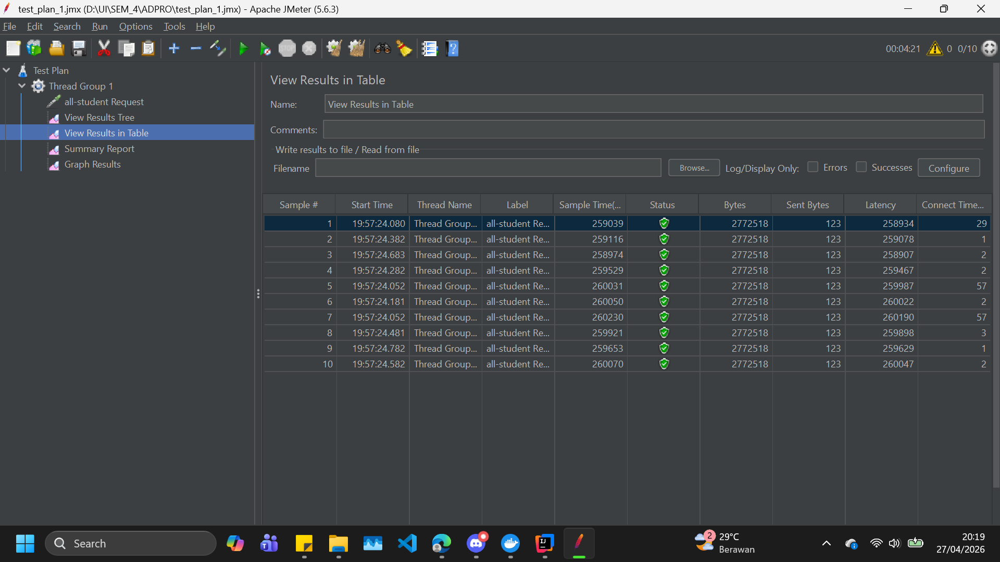
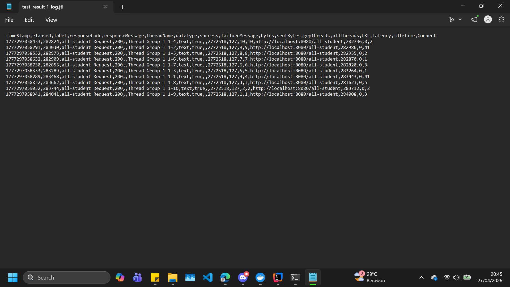
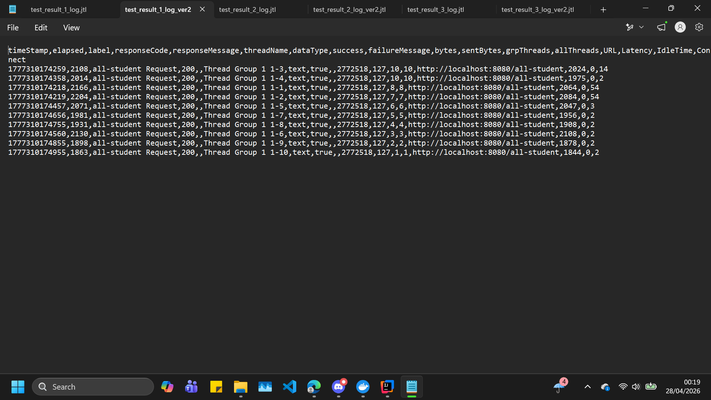
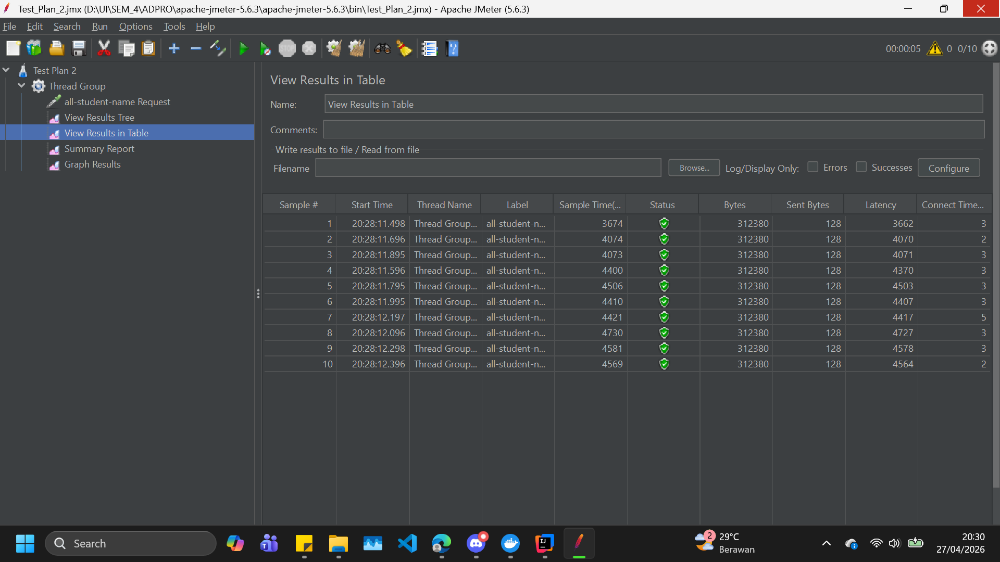
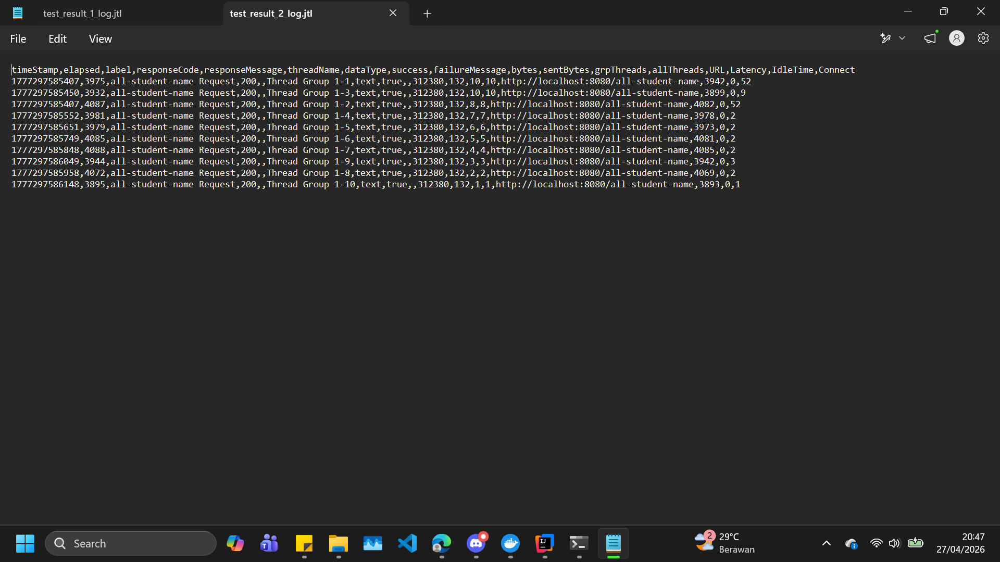
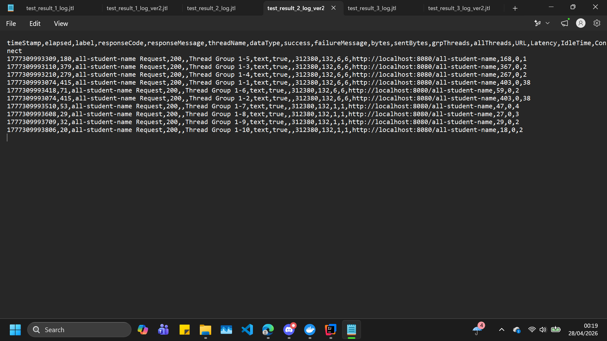
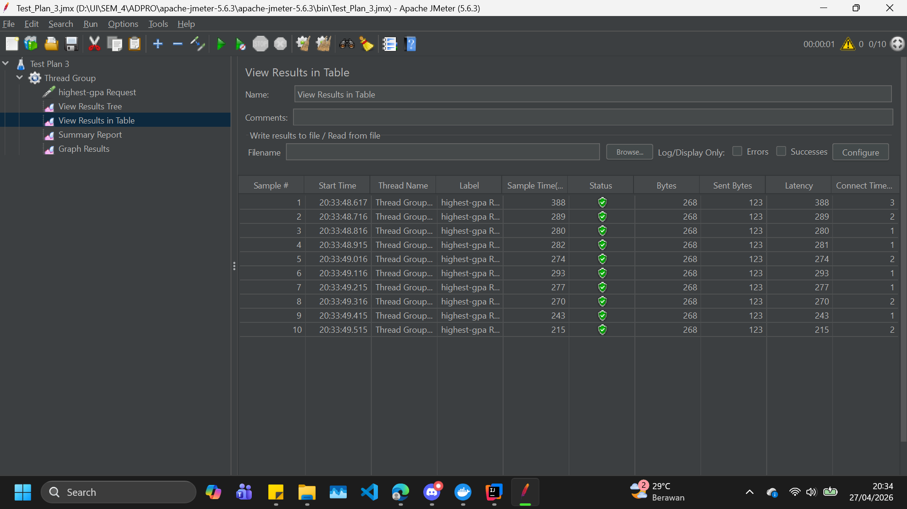
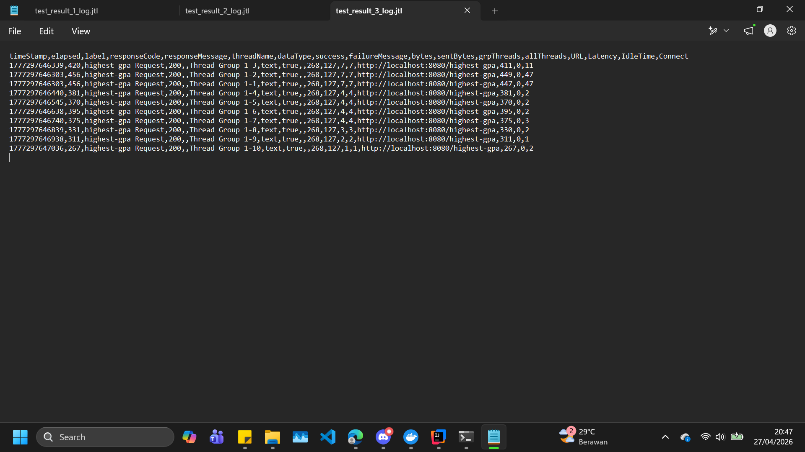
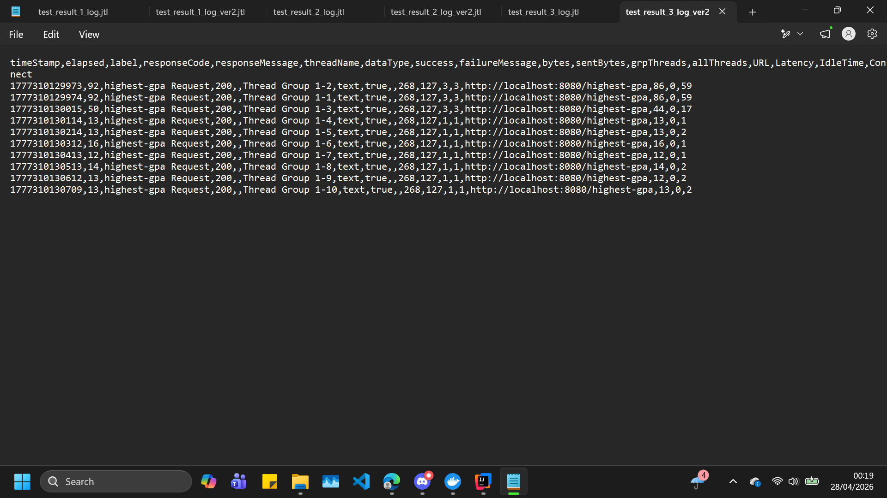

# Result Profiling with Jmeter
## GET all-student
### GUI

### CLI
#### Pre-Optimization
  
#### Post-Optimization

## GET all-student-name
### GUI

### CLI
#### Pre-Optimization

#### Post-Optimization

## GET highest-gpa
### GUI

### CLI
#### Pre-Optimization

#### Post-Optimization
  

Terdapat Improvement pada Profiling dari Jmeter setelah kita melakukan refactor pada StudentService 
untuk mengoptimalkan waktu pemanggilan API. Bisa dilihat pada kolom elapsed di gambar post-optimization 
bahwa waktu response time API telah menurun cukup signifikan.  
Kesimpulan yang saya dapat adalah profiling merupakan tools yang kuat dalam membantu kita melihat performa aplikasi kita. 
Kita dapat melihat bagian fungsi mana yang menghabiskan waktu performa sehingga kita dapat tahu dimana titik lemah kode 
kita yang sekiranya perlu direfactor.

# Reflection
## What is the difference between the approach of performance testing with JMeter and profiling with IntelliJ Profiler in the context of optimizing application performance?
Perbedaan yang dapat saya liat, Jmeter mengukur performa response time aplikasi dan seberapa stabil response time tersebut jika dijalankan berkali-kali. Sementara itu, IntelliJ Profiler itu memberikan detail response time tersebut dihabiskan menjalankan fungsi apa saja sehingga memungkinkan kita mencari kelemahan/bottleneck performa pada aplikasi kita
## How does the profiling process help you in identifying and understanding the weak points in your application? 
Pada Intellej Profiler, profiling membantu dengan merekam response time masing-masing fungsi ketika menjalankan sebuah API call. Kita dapat melihat bahwa apakah dari response time API tersebut dihabiskan mayoritas oleh suatu fungsi. Maka, kita dapat mengidentifikasi fungsi mana yang menjadi bottleneck-nya.
## Do you think IntelliJ Profiler is effective in assisting you to analyze and identify bottlenecks in your application code? 
Yap untuk alasan yang sudah disebutkan sebelumnya yakni mencari bottleneck.
## What are the main challenges you face when conducting performance testing and profiling, and how do you overcome these challenges? 
Kalau dari Jmeter mungkin kendala yang muncul adalah set-up nya sejauh ini kan hanya mengikuti modul saja jadi kurang eksplorasi dan juga agak males juga set-upnya. Selain itu, menginterpretasi datanya awalnya kesulitan juga. Sementara itu, yang membuat kesulitan pada IntelleJ Profiler itu harus merekam dan mematikan profiling secara manual, jadi harus menunggu juga API callnya selesai. Kalau lama API-nya itu bikin malas, jadi kurang otomasi saja.
## What are the main benefits you gain from using IntelliJ Profiler for profiling your application code? 
Seperti alasan no 2 dan 3 jadi lebih mudah untuk menemukan bottleneck karena response time dijelaskan secara detail pembagian response timenya.
## How do you handle situations where the results from profiling with IntelliJ Profiler are not entirely consistent with findings from performance testing using JMeter? 
Saya lebih mengacu pada Jmeter karena memang seperti simulasi user pada umumnya. Kita juga bisa melihat kestabilan response timenya per masing-masing thread (user).
## What strategies do you implement in optimizing application code after analyzing results from performance testing and profiling? How do you ensure the changes you make do not affect the application's functionality?  
Untuk menentukan fungsi mana yang harus dioptimisasi, saya melihat apakah response time suatu API dihabiskan secara besar oleh fungsi tertentu. Setelah mengoptimisasi, untuk mengecek apa fungsionalitasnya masih sama dapat menggunakan Unit Test atau merekam response yang ditampilkan di Postman.